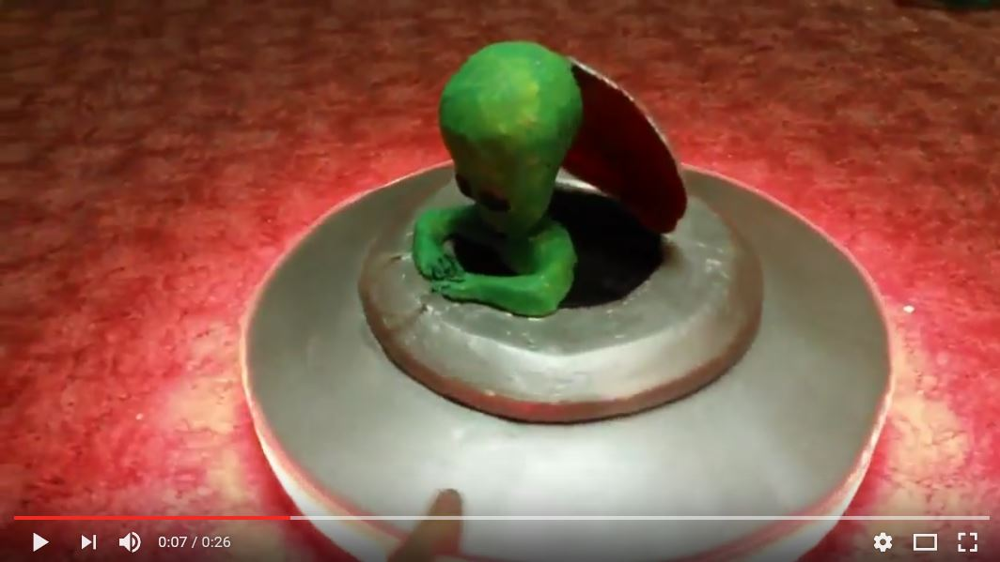
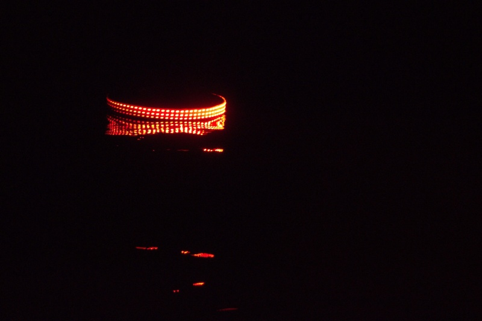
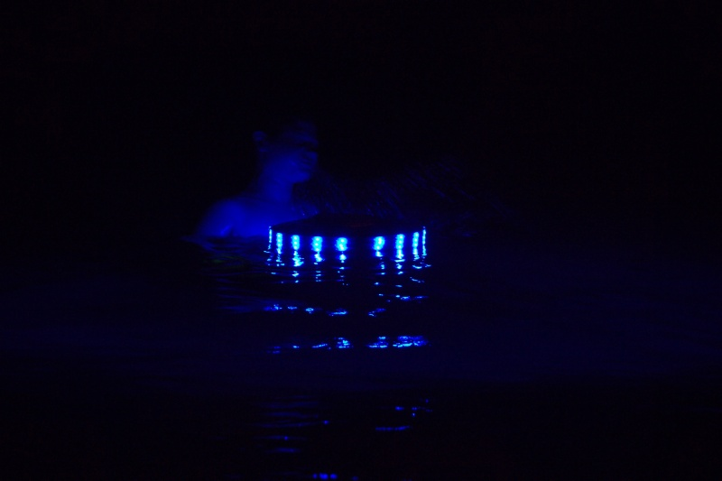

# UfoFrisbee

Waterproof, glowing, not flying but on water-floating UFO! Simple  prop for
[K-SCUK](http://kscuk.fi.muni.cz/) and
[RoboCamp](https://github.com/RoboticsBrno/RoboCamp2016). Without the top cover
ideal Frisbee for night baths at a pool.

Maybe this project will be more clear after this video:

## Photos

## Hardware

This was a quick-built project focused on effect, so there was no great
attention on documentation and technical beauty.

The body is cut from a polystyrene board, electronics is kept in round
Lock'n'lock like box to keep it dry. A 5 meter waterproof strip is glued in 3
rows around the perimeter of the thing. 1 W white Cree LED is used for the
bottom light.

The Alien was modeled from Play'Dough like material and than a gypsum mold was
created and a gypsum model was casted. See [this poor
gallery](https://goo.gl/photos/FwRLJfTSNNPLNfpg6) for at least some photos from
the process (the rest of the photos was lost due to my microSD card failure).

Arudino Nano is used as a MCU and everything is controllable via Bluetooth. UFO
can be powered from a 5 V power bank or 2 or 3-cell LiPo battery with step-down
converter (be aware of the 3-4 Amps current consumption). No hard LiPo
protection is present, UFO start glowing red, when the battery should be
disconnected.

## Software

There are two version of the firmware - the original one, used at K-SCUK, which
was written using AVRlib and a WS2812B library found on the Internet. In 2016
the project was ported to Arduino software with FastLED library to be easily
maintainable (as I suppose Arduino and its libraries might be a long-lasting
projects).

See the source code for pin numbers and connections. My future me will hate me
for this sentence.
